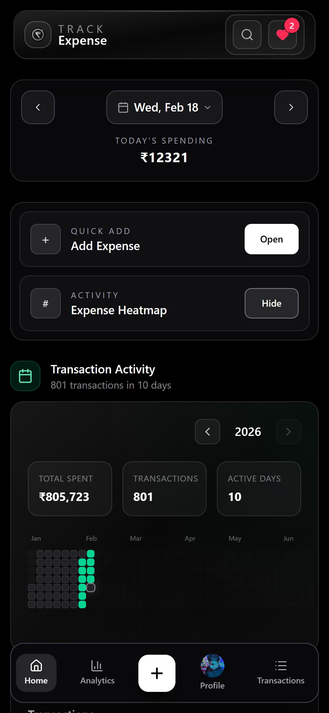
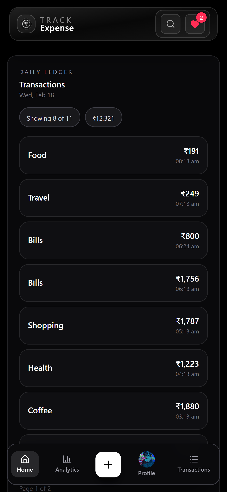
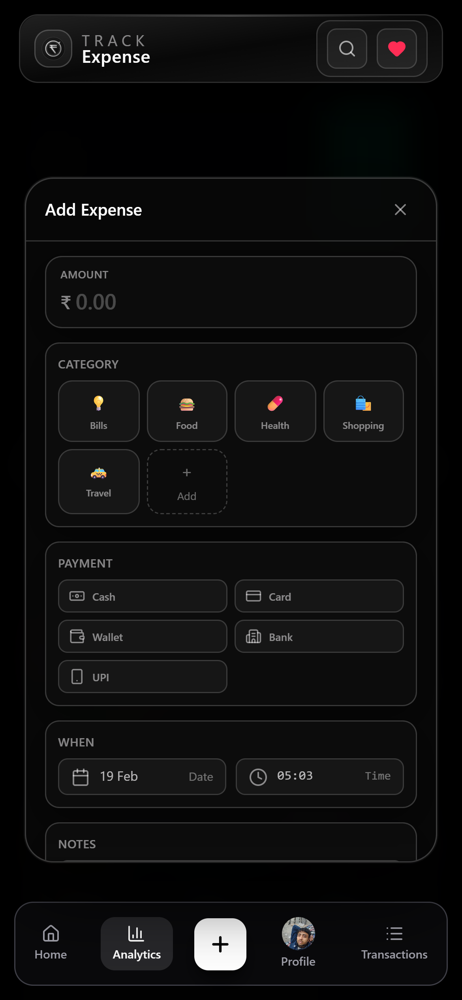
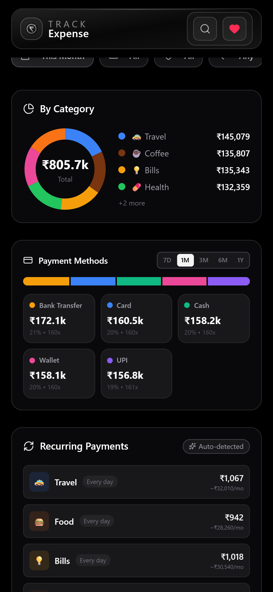
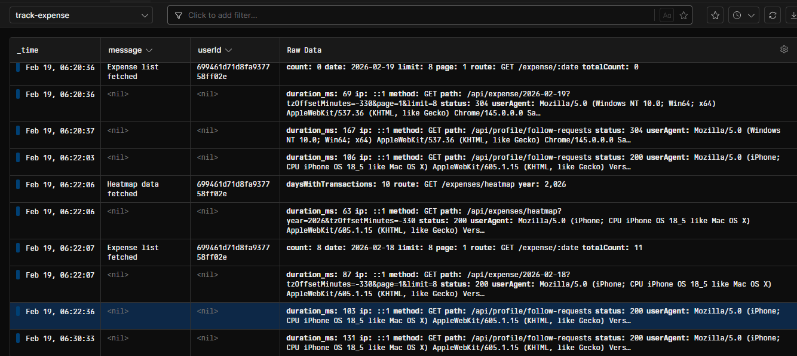
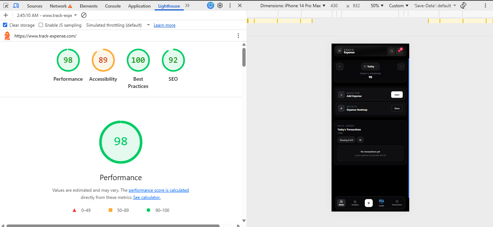
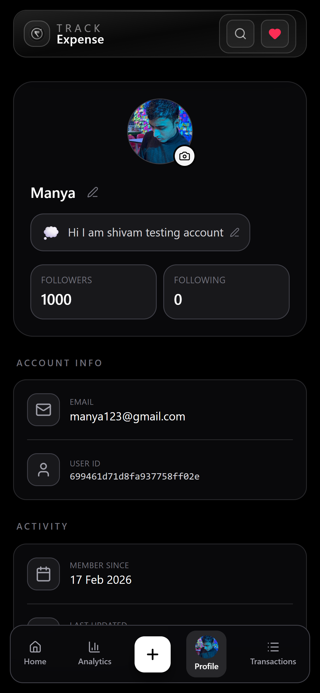
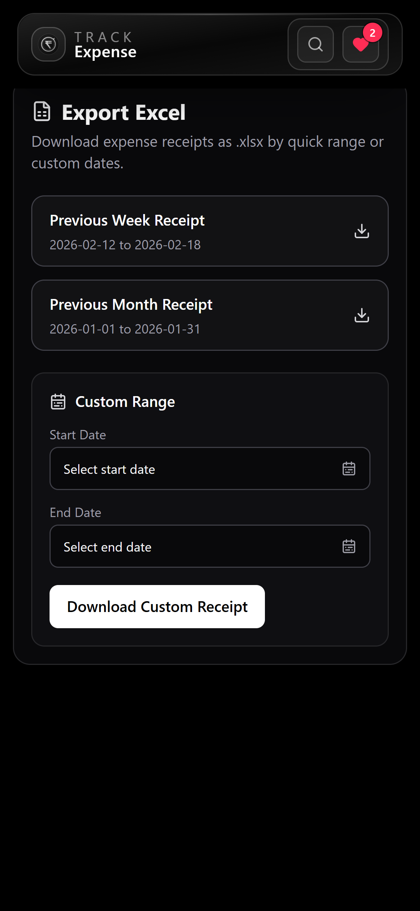

<div align="center">


### Track expenses smarter. Analyze trends faster. Scale social features securely.

[](https://www.track-expense.com/)

[](https://nodejs.org/)
[](https://expressjs.com/)
[](https://www.typescriptlang.org/)
[](https://mongoosejs.com/)
[](https://jwt.io/)
[](https://cloudinary.com/)
[](https://vercel.com/)

</div>

---

## 🌐 Live Deployment

- **Project URL:** [https://www.track-expense.com/](https://www.track-expense.com/)
- **Frontend Repository:** [https://github.com/shivamMittal088/Expense-Tracker](https://github.com/shivamMittal088/Expense-Tracker)

---

## 💡 What is Expense Tracker Backend?

Expense Tracker Backend is the API engine behind a mobile-first expense management app. It can be used to log expenses and give you a clear view of your financial situation. It handles authentication, financial data processing, social interactions, file uploads, analytics pipelines, and export workflows.

Built for production-style usage with clean route structure, secure auth flows, and scalable pagination patterns.

---

## 🧠 Engineering Insights

- Implemented **session-based authentication** with **centralized logging** for API monitoring and error tracking.
- Built scalable followers APIs using **cursor-based pagination** with **infinite scroll** and **private account handling**.
- Optimized frontend performance using **route/component lazy loading** and **modal prefetching**, reducing bundle size and improving **Lighthouse scores**.
- Enhanced efficiency by **debouncing frequent state updates** to minimize redundant API calls and configured secure profile photo uploads using **Multer + Cloudinary** storage.
- Built **data-driven APIs** for recurring payments, expense history, advanced filtering, and spending trend analysis, including an interactive **expense heatmap** for financial insights.
- Added **Excel summary transactions download support** with **date-range filtering** for reporting workflows.

---

## 📸 Screenshots

### 🏠 Home → Quick Actions

<p align="center">
  
  &nbsp;&nbsp;&nbsp;
  
</p>
<p align="center">
  
  &nbsp;&nbsp;&nbsp;
  
</p>

> **Left/Right:** Streamlined home experience with quick add and activity-focused layout.

---

### 📈 Analytics → 💸 Transactions

<p align="center">
  
  &nbsp;&nbsp;&nbsp;
  
  &nbsp;&nbsp;&nbsp;
  
</p>

> Advanced insights with trend visualizations and paginated transaction views.

---

### 🪵 Axiom Logging

<p align="center">
  
</p>

> Real-time API observability with structured event logs, response status tracking, and performance metrics.

---

### 📱 Lighthouse (Mobile)

<p align="center">
  
</p>

> Mobile Lighthouse report snapshot.

---

### 👤 Profile → 📤 Export

<p align="center">
  
  &nbsp;&nbsp;&nbsp;
  
</p>
<p align="center">
  
  &nbsp;&nbsp;&nbsp;
  
</p>

> Profile customization, public visibility controls, and date-range export workflow.

---

## ✨ Features

| Feature | Description |
|---------|-------------|
| 🔐 **Auth + Sessions** | JWT cookie auth, signup/login/logout, password update, session safety |
| 📊 **Analytics APIs** | Recurring payments, payment breakdown, spending trends, heatmap insights |
| 📄 **Export to Excel** | Date-range-based Excel export for receipt/report workflows |
| 👥 **Social Graph** | Follow requests, accept/decline flow, followers/following APIs |
| 🧭 **Pagination Strategy** | Cursor-based APIs for scalable feeds + offset-style day feed support |
| 🖼️ **Media Uploads** | Multer validation + Cloudinary storage for profile photos |
| ⚡ **Performance-Oriented** | Supports lazy-loading architecture and reduced API churn patterns |
| 📈 **Observability** | Structured logger + optional Axiom integration |

---

## 🛠️ Tech Stack

| Layer | Technology |
|:------|:-----------|
| Runtime | Node.js |
| Framework | Express 5 |
| Language | TypeScript |
| Database | MongoDB + Mongoose |
| Authentication | JWT + HTTP-only cookies |
| File Upload | Multer |
| Media Storage | Cloudinary |
| Logging | Axiom (optional) |
| Rate limiting | Redis |
| Deployment | Vercel |

---

## 🚀 Getting Started

### 1) Install

```bash
cd Backend
npm install
```

### 2) Configure environment

Create a `.env` file in `Backend/`:

```env
PORT=5000
MONGODB_URI=mongodb://localhost:27017/expense-tracker
NODE_ENV=development
FRONTEND_ORIGIN=http://localhost:5173
REDIS_URL=redis://localhost:6379

# Optional: Axiom logging
AXIOM_TOKEN=your-axiom-api-token
AXIOM_ORG_ID=your-org-id
AXIOM_DATASET=expense-tracker

# Optional: Cloudinary uploads
CLOUDINARY_CLOUD_NAME=your_cloud_name
CLOUDINARY_API_KEY=your_api_key
CLOUDINARY_API_SECRET=your_api_secret
```

### 3) Run

```bash
# Build TypeScript
npm run build

# Start server
npm start

# Dev mode (after build output exists)
npx nodemon dist/src/server.js
```

Local URLs:

- Frontend app: `http://localhost:5173`
- Backend API: `http://localhost:5000`

---

## 🐳 Docker (Pull-Only)

This project can be run directly from published Docker Hub images (no local build required).

### Images

- `shivammittal088/expense-tracker:backend-latest`
- `shivammittal088/expense-tracker:frontend-latest`
- `shivammittal088/expense-tracker:mongo-7`

### Run with Docker Compose

From project root:

```powershell
docker compose pull
docker compose up -d
```

Open:

- Frontend: `http://localhost:5173`
- Backend health check: `http://localhost:5000/test`

Stop:

```powershell
docker compose down
```

---

## 🔌 Complete API Reference

All backend routes currently used by the app are listed below.

### Authentication (`/api/auth`)

| Method | Endpoint | Purpose |
|---|---|---|
| POST | `/api/auth/signup` | Register a new user |
| POST | `/api/auth/login` | Login and set auth cookie |
| GET | `/api/auth/me` | Get current authenticated user |
| POST | `/api/auth/logout` | Logout and clear auth cookie |
| PATCH | `/api/auth/update/password` | Update password |

### Expenses (`/api`)

| Method | Endpoint | Purpose |
|---|---|---|
| POST | `/api/expense/add` | Create expense |
| GET | `/api/expense/:date` | Get visible expenses for a local date |
| GET | `/api/expense/paged` | Cursor-paginated transactions feed |
| GET | `/api/expenseMutations/:date/hidden` | Get hidden expenses for a local date |
| PATCH | `/api/expenseMutations/:expenseId/hide` | Hide (soft-delete) an expense |
| PATCH | `/api/expenseMutations/:expenseId/restore` | Restore a hidden expense |
| PATCH | `/api/expenseMutations/:expenseId` | Update expense fields (amount/category/notes/payment_mode/occurredAt) |
| GET | `/api/expenseAnalytics/range` | Get expenses for date range |
| GET | `/api/expenseAnalytics/recurring` | Recurring payments analysis |
| GET | `/api/expenseAnalytics/payment-breakdown` | Payment-mode analytics |
| GET | `/api/expenseAnalytics/spending-trends` | Spending trends analytics |
| GET | `/api/expenseAnalytics/heatmap` | Heatmap data for calendar view |
| GET | `/api/expenseExport/excel` | Export expenses to Excel |

### Profile (`/api`)

| Method | Endpoint | Purpose |
|---|---|---|
| GET | `/api/profile/view` | Get logged-in profile |
| PATCH | `/api/profile/update` | Update profile fields |
| PATCH | `/api/profile/privacy` | Update `isPublic` privacy setting |
| GET | `/api/profile/user/:userId` | Get public profile of another user |
| POST | `/api/profile/upload-avatar` | Upload/update avatar |

### Follow (`/api`)

| Method | Endpoint | Purpose |
|---|---|---|
| POST | `/api/follow/follow/:userId` | Send follow request |
| DELETE | `/api/follow/follow/:userId` | Cancel request or unfollow |
| GET | `/api/follow/follow-status/:userId` | Get relationship status |
| GET | `/api/follow/follow-requests` | Get pending incoming requests |
| POST | `/api/follow/follow-requests/:requestId/accept` | Accept follow request |
| DELETE | `/api/follow/follow-requests/:requestId` | Decline follow request |
| GET | `/api/follow/all-followers` | Get accepted followers (cursor pagination) |
| GET | `/api/follow/all-following` | Get accepted following (cursor pagination) |

### Search (`/api`)

| Method | Endpoint | Purpose |
|---|---|---|
| GET | `/api/search/recent-searches` | Get recent searches |
| POST | `/api/search/recent-searches` | Add/update recent searched user |
| DELETE | `/api/search/recent-searches` | Clear all recent searches |
| DELETE | `/api/search/recent-searches/:userId` | Remove one recent searched user |
| GET | `/api/search/search-users` | Search public users |

### Tiles & Seed (`/api`)

| Method | Endpoint | Purpose |
|---|---|---|
| GET | `/api/tile` | Get default + user tiles |
| POST | `/api/tile/add` | Add custom tile |
| DELETE | `/api/tile/remove/:id` | Remove custom tile |
| POST | `/api/seed/tiles` | Seed default tiles (if missing) |

### Utility

| Method | Endpoint | Purpose |
|---|---|---|
| GET | `/test` | Health check / server alive |

---

## 🤝 Contributing

Contributions are welcome:

1. 🐛 Report bugs with clear reproduction steps
2. 💡 Propose improvements via issues/discussions
3. 🔧 Submit PRs with focused, tested changes

---

## 📋 TODOs

- [ ] Unit testing coverage for critical APIs
- [ ] Streaks and badges support
- [ ] Story-like user activity updates
- [ ] PWA support
- [ ] Additional performance monitoring dashboards
- [ ] Add streak freeze support
- [ ] Integrate Google Sign-In API
- [ ] Add email verification code flow
- [ ] Add cron jobs for scheduled maintenance tasks
